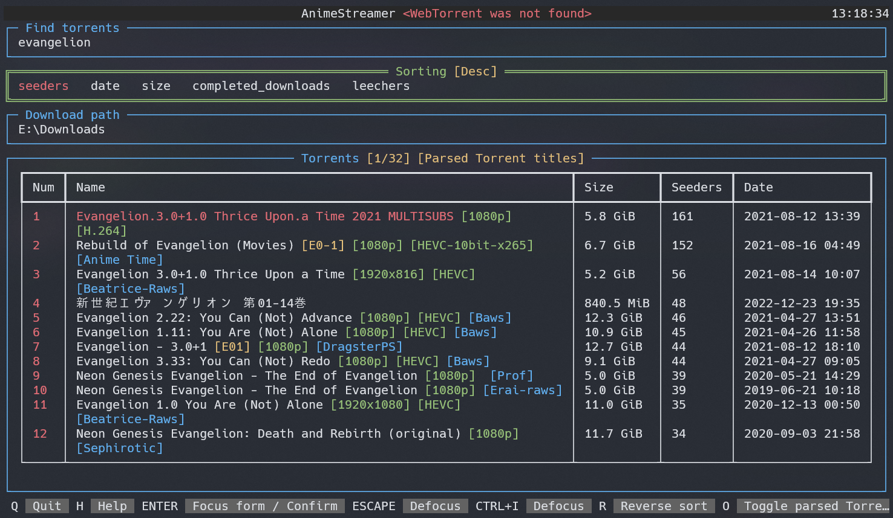

# AnimeStreamer

**AnimeStreamer** is a TUI (_Text-based user interface_) for searching through [nyaa.si](https://nyaa.si/) Torrents via [NyaaPy](https://github.com/JuanjoSalvador/NyaaPy) and streaming them via [WebTorrent](https://github.com/webtorrent/webtorrent-cli).



Torrent names can be parsed thanks to [Anitopy](https://github.com/igorcmoura/anitopy).

Uses [Textual](https://github.com/Textualize/textual) for rendering the interface.

## Dependencies

[webtorrent-cli](https://github.com/webtorrent/webtorrent-cli) → `npm install webtorrent-cli -g`

Python packages are automatically installed when installing PyPI package. List can be found in [setup.cfg](setup.cfg).

## Install and run

1. `pip install animestreamer` - [PyPI package](https://pypi.org/project/animestreamer/)
2. `animestreamer`

Alternatively, you can use `pipx` to install this application:

```bash
pipx install animestreamer
```

## Usage

You can set the default download path/player in `~/.config/animestreamer/config.json`.

You can also pass `--player` argument to temporarily set the player.

Available players are listed in the [webtorrent readme](https://github.com/webtorrent/webtorrent-cli).
